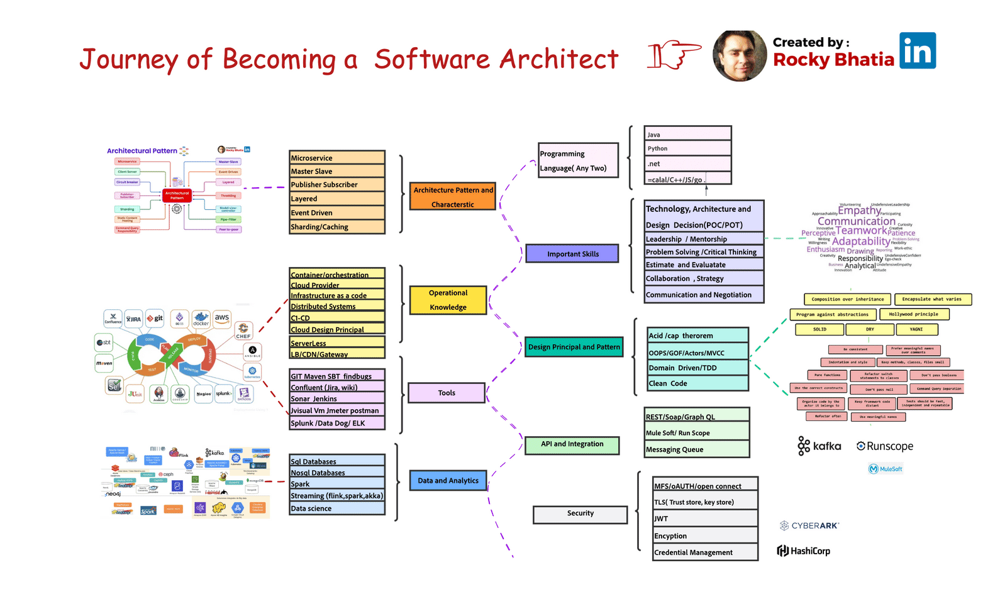

Roadmap Architect
===================================

.. note::
  This Roadmap Dotnet page.

Becoming a proficient software architect entails more than just theory; it's about practical application.
In response to numerous inquiries about the path to becoming a software architect, I've distilled my extensive experience into the comprehensive roadmap below.
The role of a software architect requires a deep understanding of software functionality, performance, scalability, security, and more. 

**Here's the roadmap:**

1. Language Proficiency:

A strong command of programming languages and frameworks is paramount. Software architects lead teams, collaborate, and review code, necessitating a profound grasp of programming concepts.

2. Architecture Patterns and Styles:

Familiarity with architectural patterns is essential—these are reusable solutions for common problems in system design:

 - Microservice
 - Event Driven
 - Layered
 - Master-Slave
 - Publisher-Subscriber

3. Design Principles and Patterns:

Design patterns provide templates for problem-solving. Knowledge of Gang of Four (GOF) patterns, Object-Oriented Programming (OOP) principles, and programming paradigms is vital. Concepts like ACID, CAP, SOLID, and domain-driven design are essential.

4. Important Skills:

Architects make critical tech decisions, mentor teams, and communicate with stakeholders. They require authority and respect, excellent communication skills, and the ability to manage system design and identify risks.

5. Operational Knowledge:

Experience in areas like containers, Infrastructure as a Service (IAAS), server less computing, Continuous Integration/Continuous Deployment (CI/CD), cloud design, distributed computing, load balancing, and security gateways enhances decision-making.

6. Data and Analytics:

A strong familiarity with tools like SQL and NoSQL databases, batch processing (e.g., Spark), stream processing (e.g., Flink, Spark Streaming), and data warehousing (e.g. Snowflake) is essential.

7. Tools:

Hands-on experience with tools such as Git, Maven, Jira, Sonar, Jenkins, JMeter, Splunk, and more is invaluable.

8. API and Integration:

Understanding REST, SOAP, GraphQL, and API management platforms (e.g., MuleSoft) and messaging queues is crucial.

9. Security:

Mastery of security aspects, including certificates, data at rest, and data in motion, is vital.

Remember, the path to becoming a proficient software architect is a dynamic journey of continuous learning and hands-on experience.

