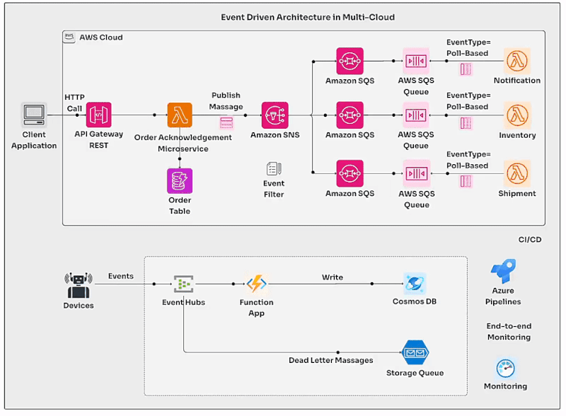

Event-Driven Architecture
===================================

.. note::
  This Event-Driven Architecture page.

Event-Driven Architecture (EDA) is emerging as a cornerstone for organizations seeking innovation and scalability.  

1. Why Decoupled Architecture Matters?  

EDA stands out in its commitment to decoupling services, breaking free from the shackles of traditional request-driven models. This decoupling empowers organizations in several ways:  

- **Scalability**: EDA simplifies the scaling of individual components, facilitating a nimble response to growing demands. It's a game-changer in a world where adaptability is key.  

2. Key Components of EDA   

EDA comprises three essential elements:  

- **Event Producer**: The initiator, responsible for generating events. Think IoT devices, applications, and external data sources.  
- **Event Broker**: The mediator, handling event distribution. This could be in the form of message brokers, streaming data services, or event meshes.  
- **Event Consumer**: The recipient, acting upon incoming events. This includes serverless functions, containers, and applications.  

3. Let's Take an Example:  

Imagine a food ordering application utilizing AWS services. Event producers trigger events based on user actions and inventory changes. AWS Lambda functions, like the Order Processing Lambda and Inventory Management Lambda, process these events in real-time. This results in swift order updates and efficient inventory management, all while retaining flexibility and cost-efficiency.  

4. Benefits of Event-Driven Architecture  

EDA presents a unique approach to system design, offering numerous advantages:  

- **Independent Scaling and Resilience**: Services can scale and recover independently, bolstering system resiliency. When one service falters, others march on.  
- **Agility in Development**: EDA streamlines event processing, replacing the need for custom code to poll and filter events. This push-based approach paves the way for on-demand actions and cost-efficient scaling.  

5. Challenges of EDA  

Transitioning to EDA brings its own set of considerations:  

- **Variable Latency**: Unlike monolithic applications, event-driven systems introduce variable latency, affecting predictability. However, this trade-off is essential for scalability and availability.  
- **Eventual Consistency**: EDA often leads to eventual consistency, which can complicate transaction processing and system state management.  
- **Returning Values**: Event-based applications are asynchronous, making the return of values or workflow results more complex compared to synchronous flows.

