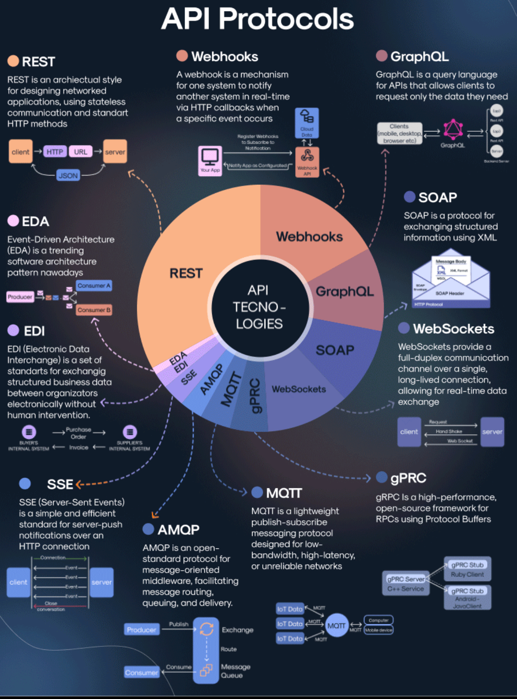

API Protocols
===================================

✍️ **01. REST**

REST is an archiectual style for designing networked applications, using stateless communication and standart HTTP methods

✍️ **02. Webhooks**

A webhook is a mechanism for one system to notify another system in real-time via HTTP callbacks when a specific event occurs

✍️ **03. GraphQL**

GraphQL is a query language for APis that allows clients to request only the data they need

✍️ **04. SOAP**

SOAP is a protocol for exchanging structured information using XML

✍️ **05. WebSockets**

WebSockets provide a full-duplex communication channel over a single, long-lived connection, allowing for real-time data exchange 

✍️ **06. gPRC**

gRPC Is a high-performance, open-source framework for RPCs using Protocol Buffers

✍️ **07. MQTT**

MQTT is a lightweight publish-subscribe messaging protocol designed for low-bandwidth, high-latency, or unreliable networks 

✍️ **08. AMQP**

AMP is an open-standard protocol for message-oriented middleware, facilitating message routing, queuing, and delivery.

✍️ **09. SSE**

SSE (Server-Sent Events) is a simple and efficient standard for server-push notifications over an HTTP connection

✍️ **10. EDI**

EDI (Electronic Data Interchange) is a set of standarts for exchangig structured business data between organizators electronically without human intervention.

✍️ **11. EDA**

Event-Driven Architecture (EDA) is a trending software architecture pattern nawadays

