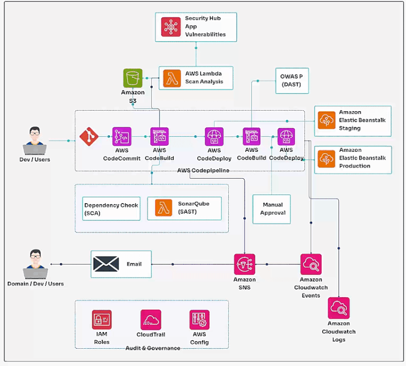

How CICD Pipeline works on AWS 
=================================

**What is CI/CD with AWS?**

CI/CD, which stands for Continuous Integration and Continuous Deployment, represents an automated approach that helps developers integrate code changes and deploy them to production with ease. AWS provides a suite of tools, such as AWS CodePipeline, CodeCommit, and CodeDeploy, to ensure your software remains in a state of readiness for rapid deployment with incremental updates.

**How Does a CI/CD Pipeline Work on AWS?**

1. Continuous Integration (CI):

- Developers create and commit code to AWS CodeCommit, a fully managed source control service.
- AWS CodeBuild automatically compiles, tests, and packages the code to ensure everything is in place.

2. Continuous Deployment (CD):

- Once the code passes the CI phase, AWS CodePipeline ensures it’s ready for deployment.
- AWS CodeDeploy automatically deploys the code to the target environments, such as EC2, ECS, or Lambda.

**Key Components of an AWS CI/CD Pipeline**

- Source Control Management (SCM): AWS CodeCommit is used for version control and storing code in a secure, scalable Git-based repository.
- Build Tools: AWS CodeBuild is a managed build service that compiles the source code, runs tests, and produces artifacts.
- Artifact Repositories: Amazon S3 or AWS CodeArtifact is used for storing build artifacts, Docker images, and application binaries, ensuring they are readily available for deployment.
- Deployment Tools: AWS CodeDeploy automates deployments to various services, including Amazon EC2 instances, ECS containers, and Lambda functions.
- Testing Automation: AWS CodeBuild integrates with testing frameworks to run unit, integration, and end-to-end tests to maintain the quality and reliability of the code.

**Benefits of AWS CI/CD**

- Faster Delivery: Smaller, frequent releases with CodePipeline accelerate feature updates and bug fixes.
- Enhanced Collaboration: AWS DevOps promotes collaborative development, enabling developers to work on different features without conflict, leading to more effective and harmonious teamwork.

