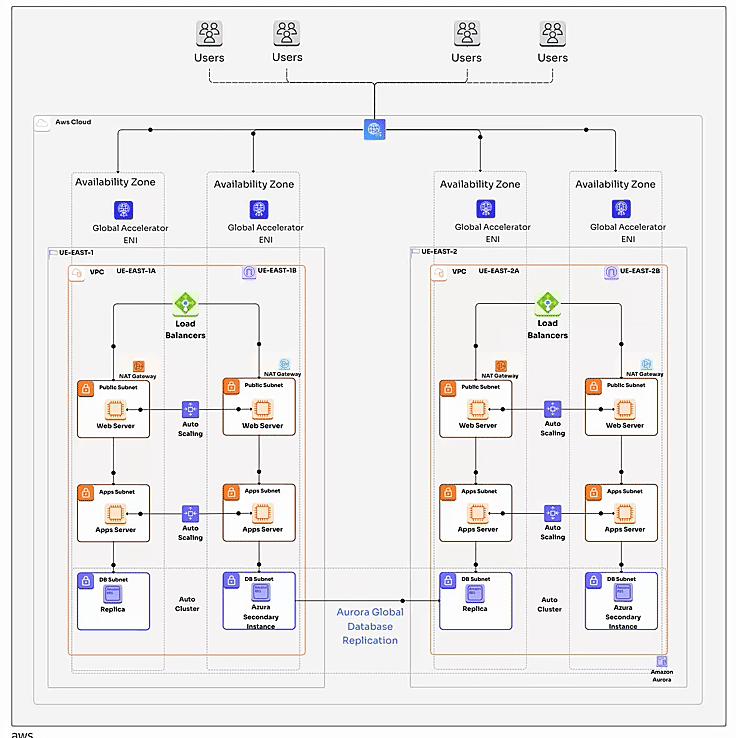

How Disaster Recovery Works in the AWS Cloud
===================================

- **Data Replication: Safeguarding Your Critical Information**  
  
AWS offers a variety of data replication services, such as AWS Storage Gateway, Amazon S3, and AWS DataSync, to ensure that your data is consistently replicated to a secondary location.

- **Compute Resources: Powering Your Recovery Efforts**  

In the event of a disaster, AWS provides a wide range of compute resources, such as Amazon EC2 instances, to quickly provision and deploy your applications and services in the secondary location.

- **Automated Scaling: Adapting to Fluctuating Demands**  

AWS Auto Scaling allows your applications to automatically adjust their capacity based on demand.

- **Load Balancing: Distributing Traffic for Optimal Performance**  

Elastic Load Balancing (ELB) helps distribute incoming application traffic across multiple targets, ensuring high availability and fault tolerance.

- **Recovery Time Objectives (RTO) and Recovery Point Objectives (RPO): Tailoring Your Recovery Plan**  

AWS provides tools to set RTO and RPO targets for your applications. These targets define the acceptable downtime and data loss in a disaster scenario.

- **AWS Disaster Recovery Architecture Network Components**  

The AWS Disaster Recovery architecture is built on a foundation of secure and reliable network components:

- **Amazon VPC (Virtual Private Cloud)**: Provides isolated network environments.

- **AWS Direct Connect or VPN**: Provides secure connectivity between your primary and secondary environments.

By leveraging these components, AWS Disaster Recovery empowers businesses to safeguard their critical systems and data, ensuring their resilience and ability to thrive in the face of disruptions.

