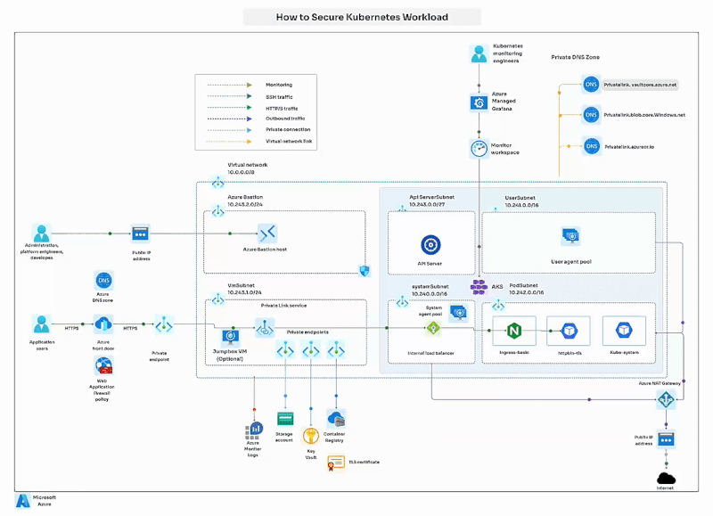

How to secure Kubernetes cluster workload
=========================================

If you're running your applications on Kubernetes in Azure, security is key. You can reference step by step guide to secure your AKS workloads using Azure Front Door:

1. Set up your AKS Cluster

Create a Kubernetes cluster in Azure. Easy setup via Azure CLI or the portal.

2. Deploy your app

Deploy your application on AKS (e.g., using a LoadBalancer service).

3. Configure Azure Front Door

- Create a Front Door instance to route traffic globally.
- Add your AKS service as a backend to handle requests.
- Set up routing rules so traffic flows correctly.

4. Enable Web Application Firewall (WAF)

Protect your app from common attacks (like SQL Injection) by enabling WAF on Front Door.

5. Turn on HTTPS

Secure all traffic using HTTPS and enforce it across the board.

6. Optional: Use Private Endpoints

For extra security, you can configure your AKS backend to only be accessible through a Private Link.

7. Test & Monitor

Test the setup by visiting your app via Front Door. Keep an eye on traffic using Azure Monitor and Application Insights!

This setup ensures your Kubernetes workloads are safe, secure, and running smoothly.

