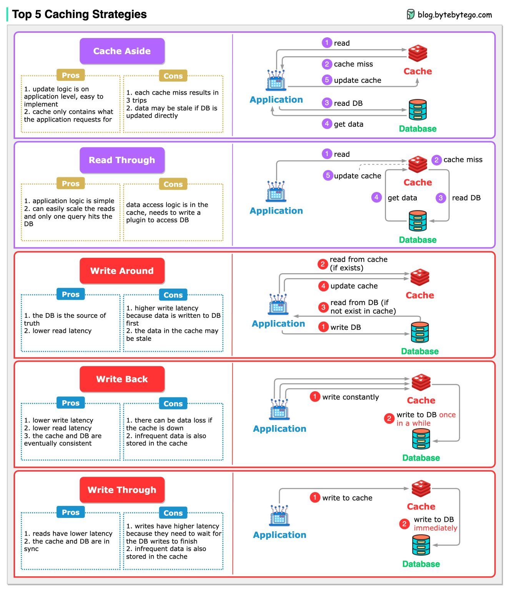

Caching Strategies
===================================

When we introduce a cache into the architecture, synchronization between the cache and the database becomes inevitable. 
5 common strategies how we keep the data in sync.

1. Read Strategies:

- Cache aside
- Read through

2. Write Strategies:

- Write around
- Write back
- Write through

The caching strategies are often used in combination. For example, write-around is often used together with cache-aside to make sure the cache is up-to-date.

