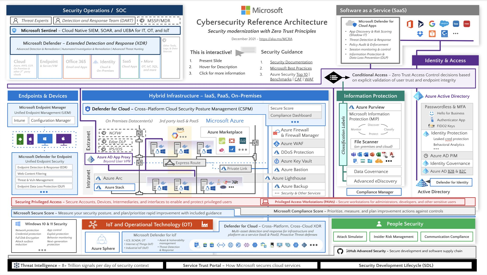

Azure Cybersecurity Reference Architecture
===================================

As Azure security cloud architects, our primary responsibility is to build and maintain secure infrastructures for our organizations. We constantly face the need to comply with various security regulations, stay updated on the latest threats and vulnerabilities, and integrate diverse security tools and technologies into our infrastructure.

To overcome these challenges, the Cybersecurity Reference Architecture for Security in a Hybrid Enterprise provides valuable guidance. It's built upon 4 key pillars, each addressing critical security challenges encountered in our daily work.

- **IAM:** Consistency in identity management across multiple sources is a crucial challenge. With Azure AD Connect, we can establish a trust relationship between on-premises Active Directory and Azure AD, ensuring seamless user authentication and access control across both environments. Azure AD Domain Services provides domain services in the cloud, enabling us to use the same identities for on-premises and cloud resources, simplifying user management and access.

- **Perimeter Security:** Securing traffic between on-premises and cloud-based perimeters is another challenge. Azure VNet allows us to create a private network in the cloud. By establishing a VNet Gateway and configuring VPN or ExpressRoute connections, we can ensure secure and encrypted communication between on-premises networks and Azure VNets. Azure ExpressRoute provides a dedicated, private connection between on-premises and Azure resources, bypassing the public internet and offering enhanced security and reliability.

- **Data Protection:** In a hybrid enterprise, data may be stored on-premises and in the cloud, requiring proper encryption and access control. AIP can help us achieve this by providing classification and labeling of sensitive information. With AIP, we can apply labels to documents and emails, ensuring consistent protection and access policies based on the sensitivity of the data. Azure Key Vault complements data protection by securely storing and managing cryptographic keys and secrets used for encryption. We can store encryption keys and secrets in Azure Key Vault, ensuring their secure retrieval and usage by authorized applications and services.

- **Security Management:** Azure Security Center offers centralized security management and threat protection for hybrid cloud workloads. It provides a unified view of security posture, continuously monitors resources for vulnerabilities and misconfigurations, and offers recommendations to improve security. Azure Sentinel complements this by providing intelligent security analytics and threat intelligence across the enterprise. It ingests security events from various sources, performs advanced analytics and correlation, and enables proactive threat detection and response.

