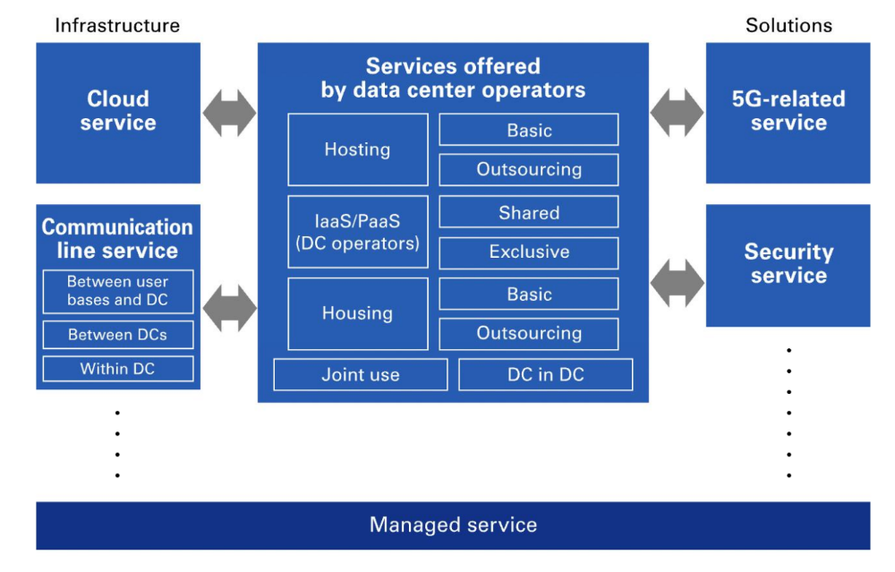

IT Infrastructure Components
===================================

IT Infrastructure Components - The Backbone of Modern Business Operations

**IT Infrastructure:**

- Definition: IT infrastructure refers to the composite hardware, software, network resources, and services required for the existence, operation, and management of an enterprise IT environment.
- Importance: IT infrastructure supports business processes, enables communication, and facilitates data management and analysis.

**IT Infrastructure Components:**

- Hardware
- Software
- Networks
- Data Centers
- Cloud Services
- Security

**Hardware**

- Servers: Powerful computers that store and process data for multiple users.
- Workstations: Personal computers used by employees.
- Networking Devices: Routers, switches, and hubs that manage data traffic.
- Peripheral Devices: Printers, scanners, and external drives.

**Software**

- Operating Systems (OS): Software that manages hardware and software resources (e.g., Windows, Linux, macOS).
- Applications: Software designed to perform specific tasks (e.g., MS Office, Adobe Suite).
- Middleware: Software that connects different applications and allows them to communicate.

**Networking**

- Local Area Network (LAN): Connects computers within a limited area.
- Wide Area Network (WAN): Connects computers across larger geographical areas.
- Internet: Global network of interconnected networks.
- Intranet: Private network accessible only to an organization's staff.

**Data Storage**

- Storage Area Networks (SAN): High-speed network that provides access to consolidated block-level storage.
- Network Attached Storage (NAS): Dedicated file storage that enables multiple users to store and retrieve data.
- Cloud Storage: Online storage solutions (e.g., Google Drive, Dropbox).

**Data Centers**

- Definition: Facilities used to house computer systems and associated components.
- Components: Servers, storage systems, backup power supplies, and climate control systems.
- Importance: Centralized locations for data processing and storage.

**Cloud Computing**

- Service Models

    + Software as a Service (SaaS)
    + Platform as a Service (PaaS)
    + Infrastructure as a Service (IaaS)

- Characteristics

    + On-demand self-service
    + Broad network access
    + Resource pooling
    + Rapid elasticity
    + Measured service

- Deployment Models

    + Private Cloud
    + Community Cloud
    + Public Cloud
    + Hybrid Cloud

**Security Solutions**

- Firewalls: Network security devices that monitor and control incoming and outgoing traffic.
- Antivirus Software: Programs that detect and eliminate malicious software.
- Encryption: Process of encoding data to prevent unauthorized access.
- Intrusion Detection Systems (IDS): Monitor networks for suspicious activity.
