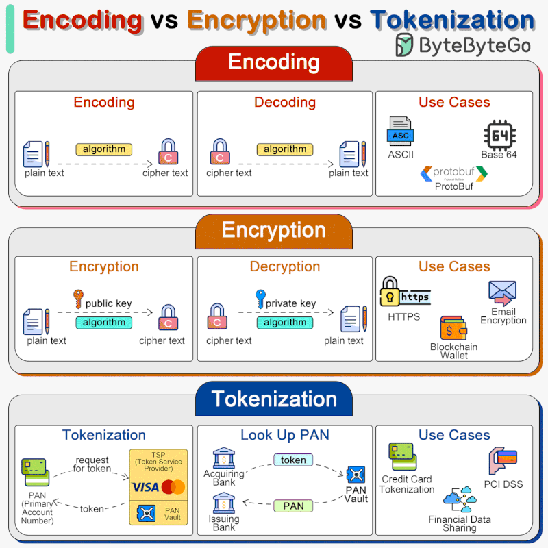

Encoding vs Encryption vs Tokenization
===================================

Encoding, encryption, and tokenization are three distinct processes that handle data in different ways for various purposes, including data transmission, security, and compliance. 
In system designs, we need to select the right approach for handling sensitive information. 
 
1. **Encoding**
Encoding converts data into a different format using a scheme that can be easily reversed. Examples include Base64 encoding, which encodes binary data into ASCII characters, making it easier to transmit data over media that are designed to deal with textual data. 
Encoding is not meant for securing data. The encoded data can be easily decoded using the same scheme without the need for a key. 
Encoding transforms data into a specific format to enable efficient transmission or storage. Importantly, it provides no security layer; its purpose is usability, not confidentiality.

**Use Cases**  
- Base64 encoding for APIs  
- ASCII, ProtoBuf for data transmission  

**Key Insight**  
Encoding is about making data usable and portable. However, misusing encoding for securing sensitive data is a common and critical error.
 
2. **Encryption**

**What It Does**  
Encryption secures data by converting it into unreadable ciphertext using algorithms and keys. Only someone with the correct decryption key can access the original data.
Encryption involves complex algorithms that use keys for transforming data. Encryption can be symmetric (using the same key for encryption and decryption) or asymmetric (using a public key for encryption and a private key for decryption). 
Encryption is designed to protect data confidentiality by transforming readable data (plaintext) into an unreadable format (ciphertext) using an algorithm and a secret key. Only those with the correct key can decrypt and access the original data. 

**Types**  
- **Public Key Encryption**: For encrypting data  
- **Private Key Decryption**: For decrypting data  

**Use Cases**  
- HTTPS for secure web communication  
- Email encryption  
- Securing blockchain wallets  

**Business Impact**  
Encryption is essential for safeguarding sensitive data during transmission and while at rest. Industries such as finance and OTT (over-the-top streaming platforms) rely on encryption to protect customer data like transactions or video streams. Neglecting encryption can lead to significant security breaches and regulatory non-compliance.

3. **Tokenization**

**What It Does**  
Tokenization replaces sensitive data with a substitute "token." This token holds no intrinsic value and is meaningless outside a secured vault where the original data resides.
Tokenization is the process of substituting sensitive data with non-sensitive placeholders called tokens. The mapping between the original data and the token is stored securely in a token vault. These tokens can be used in various systems and processes without exposing the original data, reducing the risk of data breaches. 
Tokenization is often used for protecting credit card information, personal identification numbers, and other sensitive data. Tokenization is highly secure, as the tokens do not contain any part of the original data and thus cannot be reverse-engineered to reveal the original data. It is particularly useful for compliance with regulations like PCI DSS. 

**Use Cases**  
- Tokenizing credit card information for PCI DSS compliance  
- Securing financial data in shared environments  

**Why It Matters**  
Tokenization minimizes exposure risks. If a token is leaked or stolen, the original sensitive data remains inaccessible. It’s particularly crucial for payment systems and e-commerce platforms.

4. **What Should You Focus On?**

**For OTT Platforms**  
Prioritize encryption (e.g., HTTPS) to secure content streams and protect user credentials.

**For Finance and E-Commerce**  
Combine tokenization for transaction processing (e.g., PCI DSS compliance) with encryption to secure sensitive data during transfer.

**For AI Workloads**  
Ensure APIs that handle large datasets use both encoding for portability and encryption for confidentiality.

5. **Bridging the Gap**

- **Encoding** ensures data is portable and usable across systems.  
- **Encryption** guarantees data confidentiality and protects against unauthorized access.  
- **Tokenization** limits the risk of exposure by substituting sensitive data with meaningless tokens.

Together, these techniques provide the foundation for building secure, scalable systems in cloud environments. Understanding when and how to use each is critical for ensuring the integrity and confidentiality of your data.

