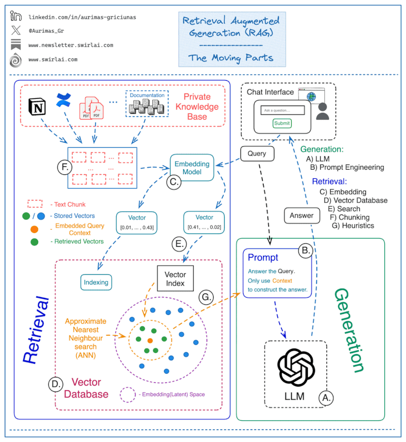

Building a RAG Based LLM System
===================================

**Building a Production-Grade Retrieval Augmented Generation (RAG) Based LLM System**

In the world of Large Language Models (LLMs), building a production-grade Retrieval Augmented Generation (RAG) system is a challenging task. It requires a combination of technical expertise and systems thinking to effectively handle the complexity inherent in such systems. Below is an outline of the critical components of RAG-based systems that require attention and continuous optimization to achieve the desired results.  

1. Retrieval  

**Chunking**  
- How do you chunk the data to use for external context?  
  - Small or large chunks.  
  - Sliding or tumbling windows for chunking.  
  - Retrieve parent or linked chunks during searching or rely solely on the originally retrieved data.  

**Choosing the Embedding Model**  
- Selecting the appropriate embedding model to embed and query external context to/from the latent space.  

**Vector Database**  
- Considerations include:  
  - Which database to use.  
  - Hosting strategy.  
  - Metadata to store alongside embeddings.  
  - Indexing strategy.  

**Vector Search**  
- Key decisions:  
  - Similarity measure to apply.  
  - Query path selection: metadata-first vs. Approximate Nearest Neighbors (ANN) first.  
  - Whether to use hybrid search.  

**Heuristics**  
- Business rules applied to the retrieval process, such as:  
  - Time importance.  
  - Reranking results.  
  - Addressing duplicate contexts (diversity ranking).  
  - Source retrieval prioritization.  
  - Conditional document preprocessing.  

2. Generation  

**Large Language Model (LLM)**  
- Choosing the right LLM for your application:  
  - The decision to use a proprietary model or self-hosting.  
  - Model performance is becoming less of a differentiator as available LLMs (both open source and proprietary) converge in quality.  

**Prompt Engineering**  
- Having external context available does not eliminate the challenges of prompt engineering. It involves:  
  - Aligning the system to produce desired outputs.  
  - Guard-railing inputs and outputs to prevent jailbreak scenarios and ensure compliance with system requirements.  

By addressing these components thoughtfully, you can build a robust RAG-based system that delivers reliable and accurate results in production settings.  

