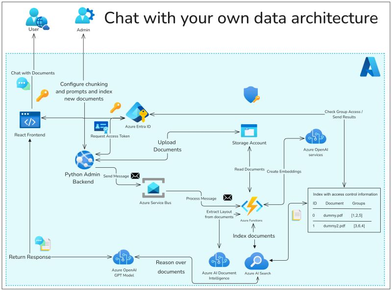

Building a Azure Open AI RAG System
===================================

Do you need a quick Open AI RAG Solution to chat with your own documents? Than I have a solution for you.

The "Chat with Your Data" Solution Accelerator brings together Azure Cognitive Search and OpenAI large language models forming a RAG pattern solution.

Here’s a breakdown of what this solution offers:

- Chat directly with an Azure OpenAI model using your own data.
- Easily deploy and manage data ingestion with multiple file types.
- Advanced prompt engineering capabilities and natural language processing.
- Admin tools for data configuration and management.

With this repo you can easily transform how your teams interact with data and improve insights! 

