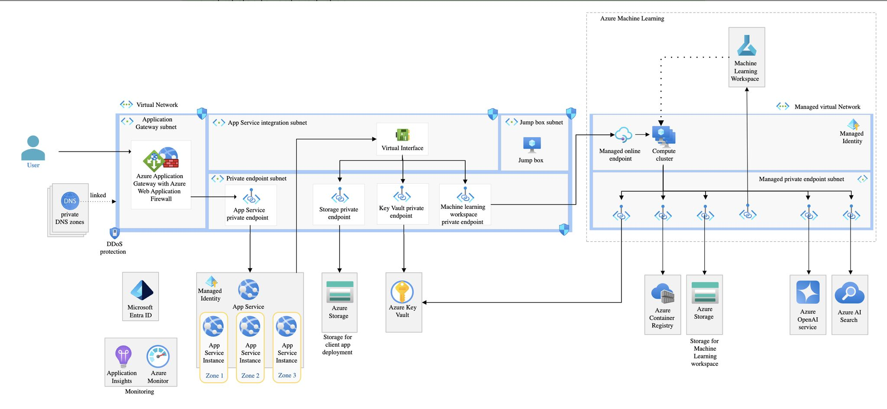

How to Build OpenAI Chat Reference Architecture on Azure
===================================

How to Build and Deploy the Baseline OpenAI End-to-End Chat Reference Architecture on Azure?

Leverage Azure's services to create a secure, scalable, and highly available web app with integrated ML.

**User and DNS**

- The end-user accesses the web app via the internet.
- DNS ensures resources can communicate using domain names, simplifying management and increasing flexibility.

**Azure App Gtw & WAF:**

- App Gtw acts as a reverse proxy and provides load balancing.
- WAF protects against web vulnerabilities like SQL injection and cross-site scripting.

**VNet**

- App Gtw Subnet for hosting the Application Gateway.
- App Service Integration Subnet for secure integration with the VNet.
- Private Endpoint Subnet keeps traffic within the Azure backbone network.
- Jump Box Subnet provides a controlled entry point into the VNet for security.

**App Service & Identity**

- App Service Instances are distributed across availability zones for high availability and fault tolerance.
- Managed Identity offers an automatically managed identity in AAD for resource access.

**Data Storage and Management**

- Key Vault Private Endpoint securely stores and accesses sensitive information like API keys, passwords, certificates, and cryptographic keys.
- Storage Private Endpoint ensures that the storage account is accessed securely over a private IP address within the VNet, protecting the data from public exposure.
- Storage for ML Workspace stores datasets, models, and other artifacts required by the MLW.

**ML & AI**

- MLW allows data scientists and developers to build, train, and deploy models.
- Compute Cluster can automatically scale up or down based on the workload.
- Managed Online Endpoint enables real-time inferencing by deploying ML models as web services.
- MLW Private Endpoint ensures secure access to the MLW, preventing unauthorized access over the internet.

**Azure Container Registry simplifies the process of managing container images and integrates with other Azure services like Kubernetes.**

**Azure OpenAI Service provides access to OpenAI’s, enabling the application to leverage advanced NLP & other AI capabilities.**

**Azure AI Search implements AI-driven search capabilities within the application, enhancing the user experience by providing intelligent search results.**

**Monitoring and Management**

- Application Insights monitors the performance and usage of the application.
- Azure Monitor provides comprehensive monitoring for applications, infrastructure, and networks

**DDoS Protection protects the application from DDoS attacks, ensuring availability and reliability even under attack.**

**Microsoft Entra ID provides SSO, MFA, and conditional access to protect against identity-driven security threats.**

**Networking**

- Virtual Interface connects various subnets within the VNet, facilitating communication between different resources such as the App Service, storage accounts, and machine learning components.

