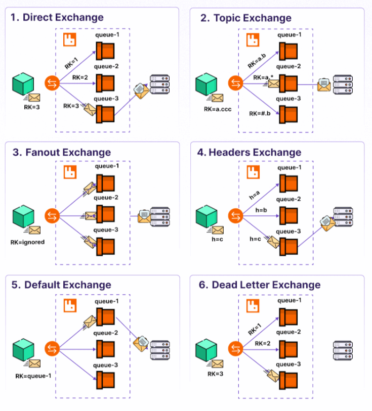

How RabbitMQ Messaging Works
===================================

RabbitMQ is one of the most popular message brokers in modern distributed systems.
RabbitMQ is an open-source message broker that facilitates the exchange of messages between producers and consumers using a publish-subscribe model. It acts as an intermediary that enables different systems to communicate asynchronously, even if they are written in different languages, run on different platforms, or are not available at the same time.

But how does messaging work with RabbitMQ? 

1. Producer:

The producer is the system that sends messages. Producers create messages and send them to exchanges in RabbitMQ. These messages can contain any type of information, such as data updates or task notifications.

2. Exchange:

An exchange receives messages from producers and determines where to route them. RabbitMQ offers several types of exchanges, each handling message routing differently:

- Direct Exchange: Routes messages to queues based on an exact matching of the routing key. Messages are routed to queues based on an exact match between the routing key (RK) and the binding key.
- Topic Exchange: Routes messages to queues based on pattern matching with the routing key. Messages are routed using wildcards based on pattern matching between the routing key and the binding key.
- Fanout Exchange: Broadcasts messages to all queues bound to it, ignoring the routing key. Messages are broadcast to all queues bound to the exchange regardless of the routing key.
- Headers Exchange: Routes messages based on message header attributes rather than a routing key. Messages are routed based on matching message headers instead of the routing key.
- Default Exchange: This is a special direct exchange where messages are routed directly to queues with the same name as the routing key.
- Dead Letter Exchange (DLX): Messages not delivered to their intended queue are routed to this exchange. 

Understanding these exchange types is crucial for designing robust messaging systems with RabbitMQ. By combining these exchanges with other RabbitMQ features like durability, acknowledgments, and retry logic, you can build systems that are:

- Fault-tolerant: Prevent message loss and handle failures gracefully.
- Scalable: Efficiently manage high volumes of messages while keeping the system responsive.
- Maintainable: Identify and handle dead or failed messages, which simplifies debugging and error handling.

3. Queue:

A queue is a buffer that stores messages until they are consumed by the consumer. RabbitMQ holds messages in a queue and delivers them in FIFO (first-in, first-out) order, although this can be configured differently.
Each queue is bound to an exchange with specific binding rules. This determines which messages from the exchange will be routed to the queue.

4. Consumer:

The consumer is the system that retrieves and processes the messages from the queue. Consumers can be any application or service that listens for messages from RabbitMQ queues. Consumers acknowledge the receipt of the message, after which RabbitMQ can either remove the message from the queue or requeue it for another attempt, depending on the configuration.
When one consumer handles a message from the queue, another consumer can't process it. This means that consumers compete with each other who will process the message. 

5. Message Flow:

The basic message flow in RabbitMQ is as follows:

- Producer sends a message to an exchange.
- The exchange routes the message to the appropriate queue based on binding rules and the routing key.
- The queue stores the message until a consumer is ready to consume it.
- The consumer receives and processes the message, optionally sending an acknowledgment to RabbitMQ.
- Once acknowledged, RabbitMQ removes the message from the queue.
 
6. Acknowledgment & Durability:

- Acknowledgment: Consumers can send acknowledgments to RabbitMQ once they have successfully processed a message. This- prevents message loss in case the consumer fails.
- Durability: RabbitMQ offers message persistence features, so even if the broker crashes, messages can be restored from- disk. Both the queue and the message must be marked as durable for this feature.

7. Prefetching and Load Balancing:

RabbitMQ allows consumers to prefetch messages, meaning they can fetch multiple messages before sending an acknowledgment. It also supports load balancing across multiple consumers by distributing messages across all connected consumers.

8. Cluster and Federation:

RabbitMQ supports clustering and federation, allowing it to be deployed in distributed environments for high availability, redundancy, and scalability. This means RabbitMQ can handle heavy loads, ensuring messages are routed even in large-scale systems.

**Key Concepts:**

- Routing Key: A string used by exchanges to decide how to route a message to queues.
- Bindings: Rules that determine the connection between an exchange and a queue.
- Virtual Host (vHost): Logical grouping of exchanges, queues, and bindings, allowing isolation between different RabbitMQ- environments.

**Ref:**

- https://www.rabbitmq.com/tutorials