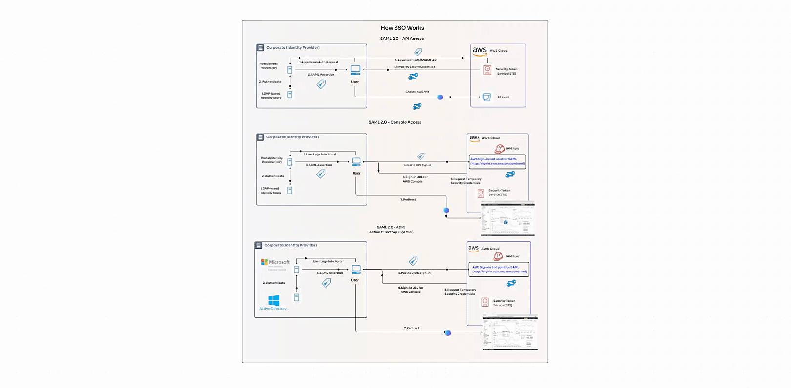

How SSO/SAML Works
==================

1. AssumeRole

Easily switch roles within your AWS account or between accounts for straightforward permission management.

2. AssumeRoleWithSAML

Use SAML (a secure standard) to get credentials for users, making sure only the right people have access.

3. AssumeRoleWithWebIdentity

For users signing in via Amazon Cognito, Google, or Facebook, AWS suggests using Cognito for a hassle-free login.

4. GetSessionToken

Boost security by adding Multi-Factor Authentication (MFA) for users or the main AWS account holder.

5. GetFederationToken

Great for apps acting on behalf of users, this gives temporary access to those who need it, keeping things flexible yet secure.

6. Identity Federation in AWS

This lets you extend AWS access to users outside of AWS, without having to individually manage each user. It's great for organizations that already have their own identity systems (like Active Directory) or for apps that need to use AWS resources.

**Key features include:**

- SAML 2.0 Integration: Works smoothly with well-known identity providers, granting temporary access to AWS services.
- Custom Identity Broker: A solution for when your identity provider isn't SAML-compatible, managing authentication and AWS access.

