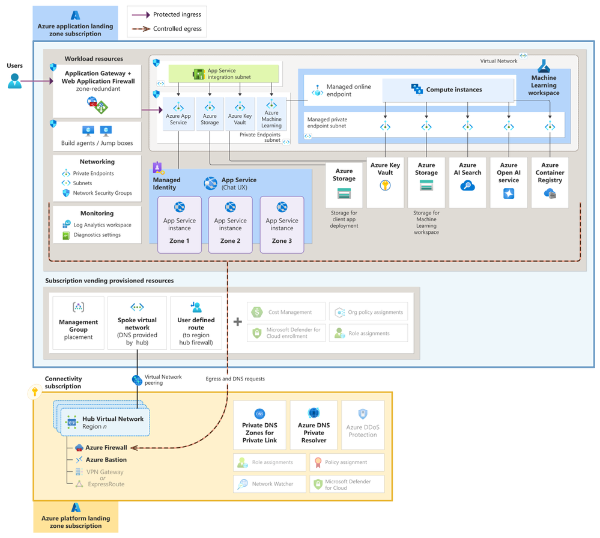

Azure OpenAI chat baseline architecture in an Azure landing zone
===================================

The architecture provides a comprehensive framework for building, deploying, and managing AI-powered chat applications. 

1. **Users Interaction access the chat application via a secure, managed endpoint.**

2. **Workload Resources**

- App Gtw + WAF

  + Provide secure and scalable access to the application.
  + Protect against common web vulnerabilities.

- Networking:

  + Private Endpoints ensure secure, isolated access to Azure services by preventing exposure to the public internet.
  + Subnets and NSGs define network boundaries and security policies to control traffic flow and protect resources.

- Monitoring:

  + Log Analytics Workspace collects and analyzes logs from various sources, providing centralized monitoring and diagnostics.

- App Service Integration Subnet:

  + Hosts the Azure App Service instances securely within the VNet.

- Azure App Service:

  + Hosts the web app and APIs required for the chat application.

- Azure Key Vault:

  + Manages and secures application secrets, keys, and certificates.

- Azure ML:

  + Provides a managed environment for deploying and operationalizing MLM.

- Managed Online Endpoint:

  + Offers secure and scalable endpoints for MLM.

- Compute Instances:

  + Scalable VMs used for running AI and MLW.

- Azure Storage:

  + Stores data required by the application, including user data, logs, and model data.

- Azure AI Services:

  + Azure OpenAI provides access to powerful language models for generating human-like text.
  + Azure AI Search enhances the application's search capabilities by providing intelligent search functionalities.
  + Azure Container Registry manages and stores Docker container images for application deployment.

3. **Subscription Vending Provisioned Resources**

- Management Group Placement:

  + Organizes Azure subscriptions under a management group for centralized governance and policy enforcement.

- Spoke VNet:

  + Isolated network environment for deploying application resources, with DNS services provided by the hub.

- User Defined Route:

  + Manages traffic routing to ensure traffic flows through the region hub firewall for security and compliance.

- Cost Management, Policy Assignments, and Security:

  + Implements governance, cost control mechanisms, and security policies.

4. **Connectivity Subscription**

- Hub VNet Region:

  + Central network hub that provides connectivity and security for all deployed resources.

- Azure Firewall secures inbound and outbound traffic, providing a centralized security point.
- Azure Bastion allows secure RDP/SSH connectivity to VMs without exposing them to the public internet.
- VPN Gateway/ExpressRoute ensures secure connectivity between on-premises networks & Azure.
- Private DNS Zones and Private Resolver manage DNS resolution within the VNET, ensuring secure and reliable name resolution.
- Azure DDoS Protection protects against Distributed Denial of Service attacks.

**Ref**

- https://techcommunity.microsoft.com/t5/azure-architecture-blog/azure-openai-chat-baseline-architecture-in-an-azure-landing-zone/ba-p/4149124

