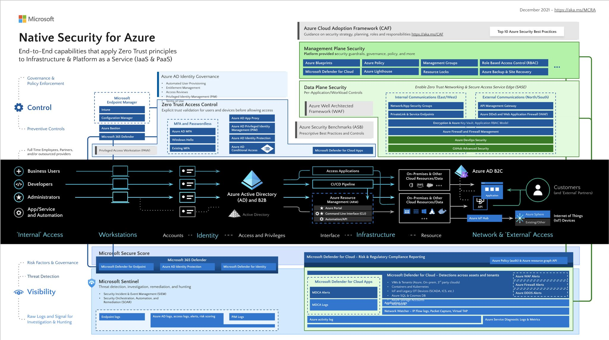

Azure Native Security Controls
===================================

**Azure Native Security Controls: Best Practices, Tools, and Strategies**

As Azure cloud architects, our primary goal is to ensure that workloads are safeguarded from threats while adhering to industry standards.

A foundational tool is the Azure CAF. It provides structured guidance for cloud adoption, focusing on best practices, security strategy, planning, roles, and responsibilities.

The Top 10 Azure Security Best Practices is a curated list of essential security measures to adopt when deploying resources in Azure. It encapsulates practical recommendations based on extensive expertise.

Diving into Azure's native security offerings, we find a suite of integrated features and tools. The Azure Security Center stands out as a centralized security management system, offering advanced threat protection across all Azure services. Complementing this, Azure Network Security includes services like Azure Firewall and VNet Service Endpoints, protecting Azure VNet resources.

Azure Information Protection classifies, labels, and secures data based on its sensitivity, using encryption and rights management. Additionally, Azure Disk Encryption ensures both OS and data disks are encrypted, utilizing BitLocker for Windows and DM-Crypt for Linux.

Azure Key Vault manages cryptographic keys and other secrets, ensuring they are stored securely with defined access permissions. Azure Confidential Computing provides a secure environment for data processing, and Azure Trusted Launch offers protection during the virtual machine boot process.

On the governance side, Management Plane hashtag#security offers platform-endorsed security measures, governance protocols, and policies. The End-to-End Capabilities for Zero Trust in IaaS & PaaS implement the Zero Trust model for Infrastructure and Platform services, supported by RBAC for detailed access management.

Azure Blueprints simplify the setup of cloud environments with governance and resource configurations. Azure Policy and Management Groups ensure resources align with corporate standards, while Azure Lighthouse provides cross-customer management capabilities for MSPs.

Data Plane Security focuses on Per-Application/Workload Controls and Automated User Provisioning for efficient user management. Entitlement Management, Access Reviews, and PIM refine access control mechanisms.
The Zero Trust Networking & SASE approach is supported by the Microsoft Endpoint Manager, which oversees the entire endpoint environment. Azure WAF & Network/App Security Groups further enhance network security.

For threat detection, Microsoft Secure Score evaluates an organization's security posture. Microsoft Defender for Cloud and Microsoft 365 Defender offer comprehensive threat protection, while Azure Policy & Azure resource graph API facilitate resource and configuration audits.

Lastly, hashtag#azure activity log and Azure Service Diagnostic Logs & Metrics provide detailed operational data, ensuring both performance and security are optimized.

