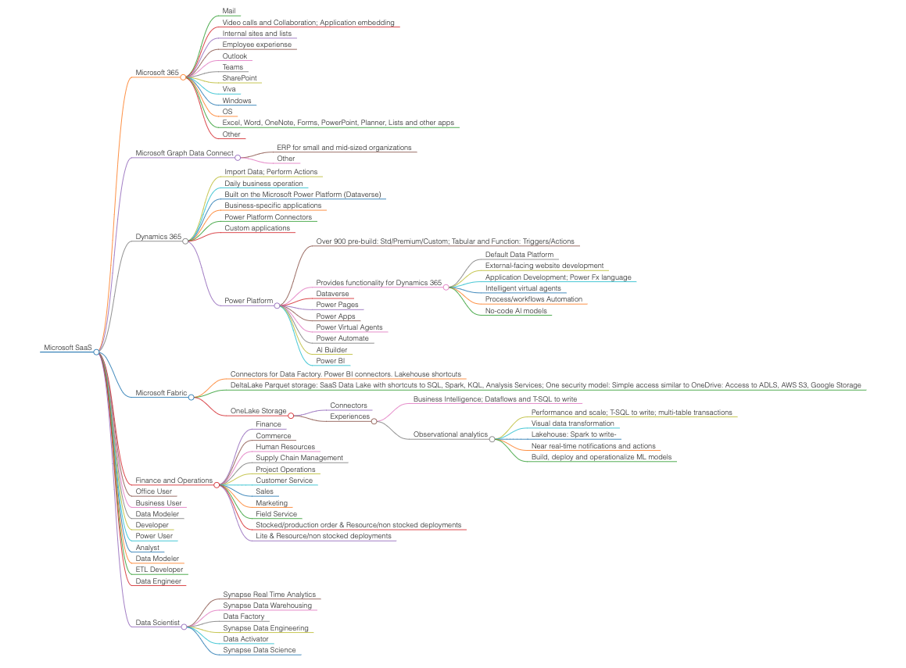

Microsoft SaaS
===================================

.. note::
  This Microsoft SaaS page.

-  **Microsoft 365**

   -  Mail
   -  Video calls and Collaboration; Application embedding
   -  Internal sites and lists
   -  Employee experiense
   -  Outlook
   -  Teams
   -  SharePoint
   -  Viva
   -  Windows
   -  OS
   -  Excel, Word, OneNote, Forms, PowerPoint, Planner, Lists and
      other apps
   -  Other

-  **Microsoft Graph Data Connect**

   -  ERP for small and mid-sized organizations
   -  Other

-  **Dynamics 365**

   -  Import Data; Perform Actions
   -  Daily business operation
   -  Built on the Microsoft Power Platform (Dataverse)
   -  Business-specific applications
   -  Power Platform Connectors
   -  Custom applications
   -  Power Platform

      -  Over 900 pre-build: Std/Premium/Custom; Tabular and
         Function: Triggers/Actions
      -  Provides functionality for Dynamics 365

         -  Default Data Platform
         -  External-facing website development
         -  Application Development; Power Fx language
         -  Intelligent virtual agents
         -  Process/workflows Automation
         -  No-code Al models

      -  Dataverse
      -  Power Pages
      -  Power Apps
      -  Power Virtual Agents
      -  Power Automate
      -  Al Builder
      -  Power BI

-  **Microsoft Fabric**

   -  Connectors for Data Factory. Power BI connectors. Lakehouse
      shortcuts
   -  DeltaLake Parquet storage: SaaS Data Lake with shortcuts to
      SQL, Spark, KQL, Analysis Services; One security model: Simple
      access similar to OneDrive: Access to ADLS, AWS S3, Google
      Storage
   -  OneLake Storage

      -  Connectors
      -  Experiences

         -  Business Intelligence; Dataflows and T-SQL to write
         -  Observational analytics

            -  Performance and scale; T-SQL to write; multi-table
               transactions
            -  Visual data transformation
            -  Lakehouse: Spark to write-
            -  Near real-time notifications and actions
            -  Build, deploy and operationalize ML models

-  **Finance and Operations**

   -  Finance
   -  Commerce
   -  Human Resources
   -  Supply Chain Management
   -  Project Operations
   -  Customer Service
   -  Sales
   -  Marketing
   -  Field Service
   -  Stocked/production order & Resource/non stocked deployments
   -  Lite & Resource/non stocked deployments

-  **Office User**
-  **Business User**
-  **Data Modeler**
-  **Developer**
-  **Power User**
-  **Analyst**
-  **Data Modeler**
-  **ETL Developer**
-  **Data Engineer**
-  **Data Scientist**

   -  Synapse Real Time Analytics
   -  Synapse Data Warehousing
   -  Data Factory
   -  Synapse Data Engineering
   -  Data Activator
   -  Synapse Data Science

